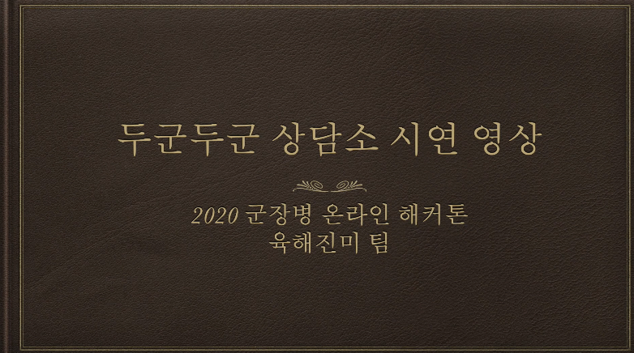
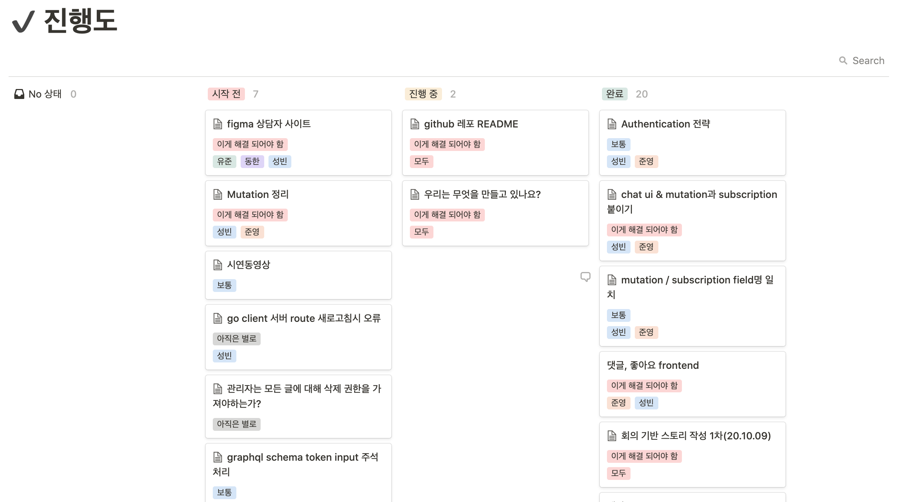
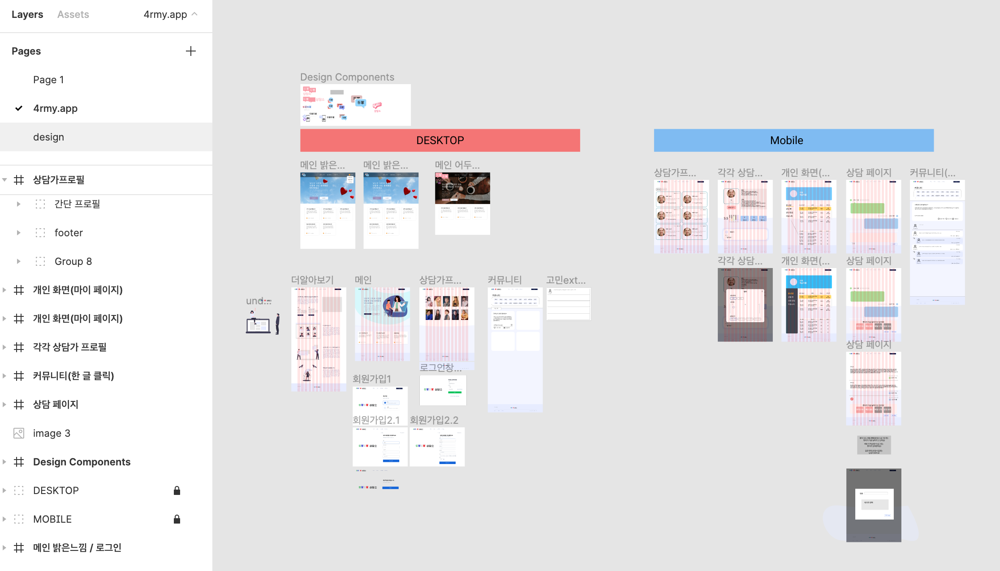
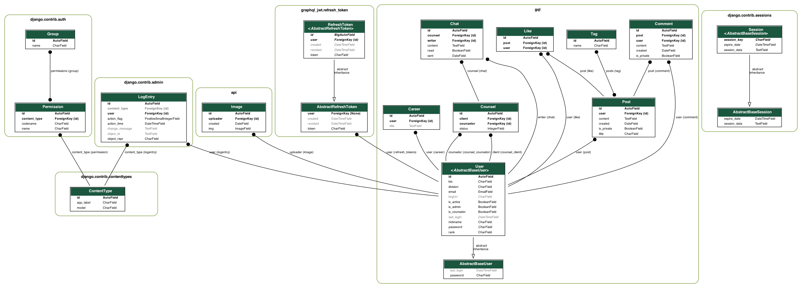
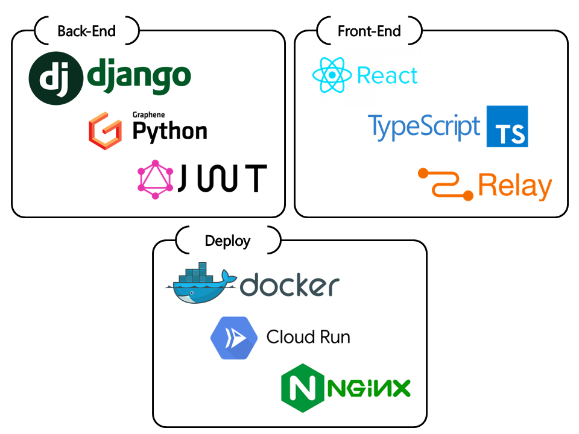
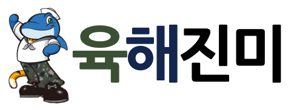

#  두軍두軍 상담소

##  프로젝트 시연 동영상
<a href="https://youtu.be/TA9kBvD3mos" target="_blank"></a>

> 이미지를 클릭하시면 이동합니다.

<br/>

##  프로젝트 설계 과정

### <a href="https://www.notion.so/OSAM-66aec75349664b6693f56ad80575f903"></a> Notion

> 팀원 간 프로젝트 진행과 관련된 이슈 공유 및 임무 분담



<br/>

### <a href="https://beecanvas.com/s/61Hk2QZQV8gctG3M10Z3leIbGCS0DalxOeH_aWvhZrVXu7dzfXvxE-SvwGon8Rwr"></a> BeeCanvas - 사용자 스토리 작성

> 팀원 간 대면하여 소통하기에 제한이 있으므로 공유된 이해를 갖기 위해 스토리 작성을 진행하며 회의 진행


<br/>

###  Figma 사용하여 디자인 작업 진행

> 정해진 스토리를 기반으로 디자인 작업 진행



<br/>

###  ERD 작성

> 두군두군 상담소 서비스에 필요한 데이터베이스 구조를 잡기위해 ERD 작성



<br/>

###  [GraphQL Schema](https://api.4rmy.app/playground) 작성

> 서버, 클라이언트 개발자가 [Schema 파일](https://github.com/osamhack2020/WEB_4rmyClinic_YukHaeJinMi/blob/master/client/react/schema.graphql)을 공유함으로써 수정 현황에 대한 협업 상태를 유지하기에 편리함.

```graphql
schema {
  query: Query
  mutation: Mutation
  subscription: Subscription
}

type Mutation {
  userCreate(input: UserCreateInput!): UserCreatePayload
  userProfileImgSet(input: UserProfileImgSetInput!): UserProfileImgSetPayload
  userInfoUpdate(input: UserInfoUpdateInput!): UserInfoUpdatePayload
  postCreate(input: PostCreateInput!): PostCreatePayload
  postUpdate(input: PostUpdateInput!): PostUpdatePayload
  postDelete(input: PostDeleteInput!): PostDeletePayload
  likeToggle(input: LikeToggleInput!): LikeTogglePayload
  commentCreate(input: CommentCreateInput!): CommentCreatePayload
  commentDelete(input: CommentDeleteInput!): CommentDeletePayload
  authToken(input: ObtainJSONWebTokenInput!): ObtainJSONWebTokenPayload
  verifyToken(input: VerifyInput!): VerifyPayload
  refreshToken(input: RefreshInput!): RefreshPayload
  revokeToken(input: RevokeInput!): RevokePayload
  deleteTokenCookie(input: DeleteJSONWebTokenCookieInput!): DeleteJSONWebTokenCookiePayload
  deleteRefreshTokenCookie(input: DeleteRefreshTokenCookieInput!): DeleteRefreshTokenCookiePayload
  chatSend(input: ChatSendInput!): ChatSendPayload
  counselStart(input: CounselStartInput!): CounselStartPayload
  counselStatusUpdate(input: CounselStatusUpdateInput!): CounselStatusUpdatePayload
}

type Query {
  node(id: ID!): Node
  user(id: ID!): UserNode
  post(id: ID!): PostNode
  tag(id: ID!): TagNode
  counsel(id: ID!): CounselNode
  chat(id: ID!): ChatNode
  career(id: ID!): CareerNode
  users(before: String, after: String, first: Int, last: Int, email_Icontains: String, division_Icontains: String, rank_Icontains: String, isCounselor: Boolean): UserNodeConnection
  tags(name_Icontains: String, before: String, after: String, first: Int, last: Int): TagConnection
  posts(before: String, after: String, first: Int, last: Int): PostConnection
  counselors(before: String, after: String, first: Int, last: Int): CounselorConnection
  getUserFromEmail(email: String!): UserNode
}

type Subscription {
  messageSent(counselId: ID!): MessageSent
}
```

<br/>

##  기술 스택


> [모든 dependency 보기](https://github.com/osamhack2020/WEB_4rmyClinic_YukHaeJinMi/network/dependencies)

<br/>

##  설치 안내 (Installation Process)

* **Python(3.8.5)**, **Node.JS LTS(12.19.0)** 이상이 설치되어 있어야합니다.

```bash
# Repository Clone
git clone https://github.com/osamhack2020/web_4rmyclinic_yukhaejinmi

# 1) Django Server Setting
cd server
pip install -r requirements.txt
cd clinic
python manage.py makemigrations
python manage.py migrate
python manage.py loaddata fixture.json # To load sample data
python manage.py runserver


# 2) React Client Setting
pwd 				# Web_4rmyClinic_YukHaeJinmi
cd client/react
touch .env.endpoint
# REACT_APP_DEV_SERVER=http://localhost:8000 또는 개발환경에서 사용하는 장고 서버 주소를 입력해야합니다.
npm i
npm run relay -- --watch # watch 모드를 실행하려면 watchman이 설치되어있어야합니다.
npm run dev
		# npm start는 배포되어있는 서버와 연결됩니다.
		# npm run dev는 REACT_APP_DEV_SERVER 에서 실행되고 있는 장고 서버와 연결됩니다.
```

<br/>

##  팀원 정보

- 이성빈 (lee@sungbin.dev), Github: [@leesungbin](https://github.com/leesungbin)
- 홍유준 (hyjhyj0901@gmail.com), Github: [@Kick-snare](https://github.com/kick-snare)

- 이준영 (rubinstory@naver.com), Github: [@rubinstory](https://github.com/rubinstory)
- 박동한 (donghanpark@naver.com), Github: [@donghanpark](https://github.com/donghanpark)

<br/>

##  License


